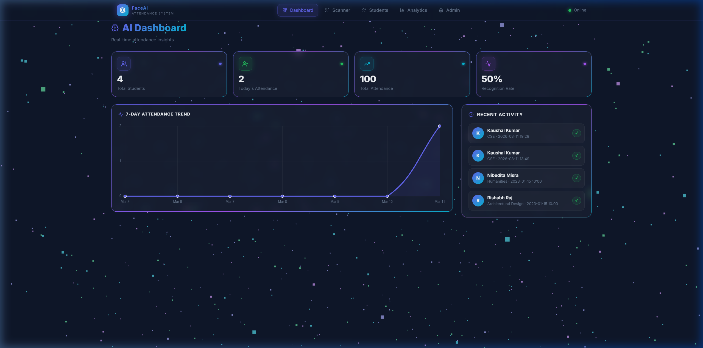
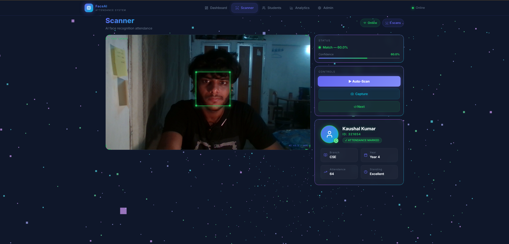
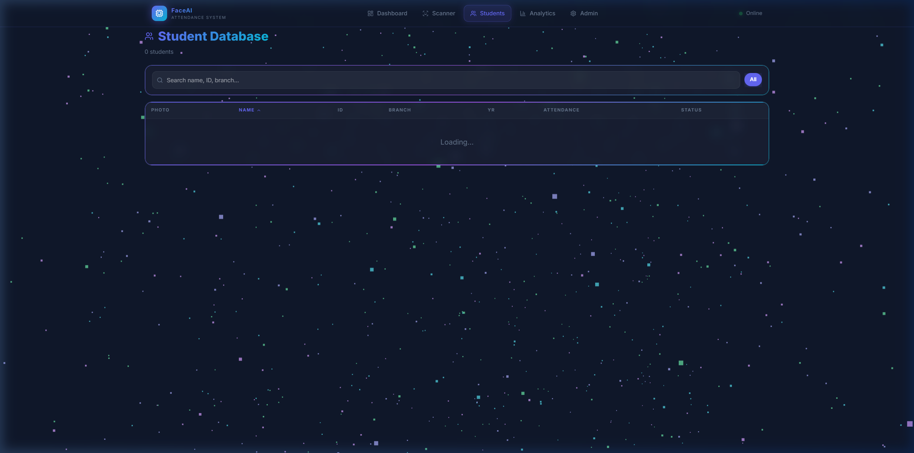
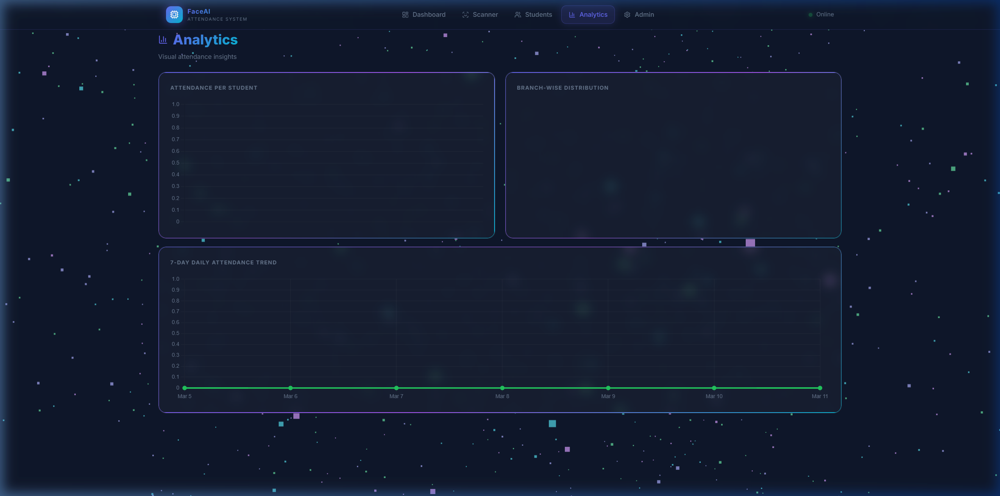
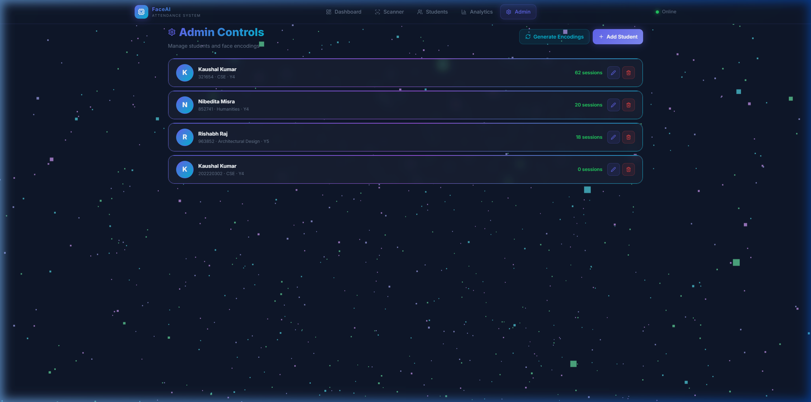

# 🤖 FaceAI – Automated AI Attendance System

<div align="center">


**A full-stack, AI-powered attendance system with a React dashboard and a FastAPI backend**

[Features](#-features) • [Architecture](#-system-architecture) • [Installation](#-installation) • [Usage](#️-usage) • [API Reference](#-api-reference)

</div>

---

## 📋 Table of Contents

- [Overview](#-overview)
- [Screenshots](#-screenshots)
- [Features](#-features)
- [Technologies Used](#️-technologies-used)
- [System Architecture](#-system-architecture)
- [Project Structure](#-project-structure)
- [Installation](#-installation)
- [Firebase Setup](#-firebase-setup)
- [Usage](#️-usage)
- [API Reference](#-api-reference)
- [Troubleshooting](#-troubleshooting)

---

## 📖 Overview

**FaceAI** is a sophisticated, full-stack automated attendance system that uses real-time facial recognition to detect and record student attendance — no manual input required.

The system is split into two main layers:

| Layer | Tech | URL |
|-------|------|-----|
| **Backend API** | Python · FastAPI · face_recognition · Firebase | `http://localhost:8000` |
| **Frontend Dashboard** | React 19 · Vite · Tailwind CSS · Framer Motion | `http://localhost:5173` |

**Key Highlights:**
- ⚡ Real-time webcam face scanning via the browser
- 🧠 128-dimensional face embeddings with multi-scale HOG detection
- 📊 Live analytics dashboard with charts
- 👤 Full student CRUD with image upload
- ☁️ Firebase Realtime Database + Storage for cloud persistence
- 🔒 Duplicate attendance prevention (30-second cooldown)
- 🎨 Animated, responsive UI with particle background

---

## 📸 Screenshots

<div align="center">

### 🏠 Dashboard – Live Stats & Attendance Trend

*Real-time stats cards, 7-day attendance trend chart, and recent activity feed*

### 📷 Scanner – Live Webcam Face Recognition

*Webcam feed with Auto-Scan mode, status indicator, and scan controls*

### 👥 Students – Student Database

*Searchable student table with photo, name, branch, year, and attendance columns*

### 📊 Analytics – Attendance Insights

*Attendance per student, branch-wise distribution, and 7-day daily trend charts*

### 🔧 Admin Controls – Manage Students & Encodings

*Generate encodings, add/edit/delete students with session counts*

</div>

---

## 🚀 Features

### Frontend (React Dashboard)
- **📍 Live Scanner** – Webcam capture via `react-webcam`, sends frames to the backend for recognition
- **📊 Analytics** – Charts (Chart.js) showing attendance trends over time
- **👥 Student Management** – Add, edit, delete students with photo upload
- **🔧 Admin Panel** – Generate/refresh face encodings without restarting the server
- **🏠 Dashboard** – System stats: total students, today's attendance, all-time count
- **✨ Animated UI** – Framer Motion transitions, 3D particle background (Three.js), responsive Navbar
- **📱 Fully Responsive** – Mobile-first layout that adapts from 320px to 4K

### Backend (FastAPI)
- **`POST /recognize`** – Accept a JPEG image, run face recognition, return matched student + confidence
- **`GET/POST/PUT/DELETE /students`** – Full CRUD with optional image upload
- **`POST /encodings/generate`** – Regenerate all face encodings from local + Firebase Storage images
- **`GET /stats`** – Aggregate stats: total students, today's count, all-time attendance
- **`GET /health`** – Health check endpoint
- **Interactive Swagger UI** at `/docs`

### AI / Recognition Engine
- Multi-scale HOG face detection (50% scale + full-res fallback)
- YCrCb luminance equalisation for poor lighting
- 128-dim face embeddings with `num_jitters=2` for robustness
- Tolerance-based comparison (configurable, default `0.55`)
- Hot-reloadable in-memory encodings (no server restart needed)

---

## 🛠️ Technologies Used

### Backend
| Technology | Purpose | Version |
|------------|---------|---------|
| **Python** | Core language | 3.10+ |
| **FastAPI** | REST API framework | 0.109.2 |
| **Uvicorn** | ASGI server | 0.27.1 |
| **face_recognition** | Face embeddings & matching | 1.3.0 |
| **OpenCV (cv2)** | Image preprocessing | 4.9.0 |
| **NumPy** | Numerical ops | 1.26.4 |
| **Firebase Admin SDK** | DB & Storage | 6.4.0 |
| **Pillow** | Image handling | 10.2.0 |
| **python-multipart** | File uploads | 0.0.9 |
| **pickle** | Encoding serialisation | built-in |

### Frontend
| Technology | Purpose |
|------------|---------|
| **React 19** | UI framework |
| **Vite 7** | Build tool & dev server |
| **Tailwind CSS 4** | Utility-first styling |
| **Framer Motion** | Animations & transitions |
| **React Router DOM 7** | Client-side routing |
| **Axios** | HTTP client (`/api/*`) |
| **Chart.js + react-chartjs-2** | Analytics charts |
| **react-webcam** | Webcam capture |
| **Three.js + @react-three/fiber** | 3D particle background |
| **lucide-react** | Icon library |

---

## 🏗️ System Architecture

```
┌──────────────────────────────────────────────────────────────┐
│                  FaceAI – System Architecture                 │
├──────────────────────────────────────────────────────────────┤
│                                                              │
│  ┌──────────────────┐         ┌──────────────────────────┐  │
│  │  React Frontend  │ ◄─────► │  FastAPI Backend          │  │
│  │  (Vite · port    │  REST   │  (Uvicorn · port 8000)   │  │
│  │   5173)          │  JSON   │                          │  │
│  └──────────────────┘         └──────────┬───────────────┘  │
│                                          │                   │
│         ┌────────────────────────────────┤                   │
│         │                                │                   │
│  ┌──────▼──────┐              ┌──────────▼──────────┐        │
│  │ face_service│              │  firebase_service   │        │
│  │  (HOG +     │              │  Realtime DB +      │        │
│  │   dlib)     │              │  Cloud Storage      │        │
│  └──────┬──────┘              └─────────────────────┘        │
│         │  EncodeFile.p                                       │
│         │  (pickle)                                           │
│  ┌──────▼──────┐                                             │
│  │  Images/    │ ◄── local student photos                    │
│  └─────────────┘                                             │
│                                                              │
└──────────────────────────────────────────────────────────────┘
```

### Request Flow – Attendance Scan

```
Browser Webcam
     │  JPEG frame
     ▼
POST /recognize (FastAPI)
     │
     ├─► _bytes_to_rgb_array()
     ├─► _preprocess()  (YCrCb equalise + Gaussian blur)
     ├─► face_locations() @ 50% scale  ──► fallback full-res
     ├─► face_encodings()  (128-dim vector, 2 jitters)
     ├─► face_distance()   (Euclidean vs. known encodings)
     ├─► compare_faces()   (tolerance = 0.55)
     │
     ├─► IF matched → fetch student from Firebase
     │              → check last_attendance_time
     │              → IF > 30 s → increment & update DB
     │              → return { matched, student_id, confidence, … }
     │
     └─► ELSE → return { matched: false, … }
```

---

## 📁 Project Structure

```
Automated AI Attendance System/
│
├── 📂 backend/                    # FastAPI application
│   ├── main.py                    # App entry-point, middleware, startup
│   ├── face_service.py            # AI recognition engine (HOG, encodings)
│   ├── firebase_service.py        # Firebase DB & Storage helpers
│   ├── requirements.txt           # Python dependencies
│   └── routes/
│       ├── __init__.py
│       ├── recognize.py           # POST /recognize
│       ├── attendance.py          # Attendance endpoints
│       ├── students.py            # CRUD /students
│       └── encodings.py          # POST /encodings/generate
│
├── 📂 frontend/                   # React + Vite application
│   ├── index.html
│   ├── vite.config.js
│   ├── package.json
│   └── src/
│       ├── main.jsx               # App entry, ReactDOM
│       ├── App.jsx                # Router & top-level layout
│       ├── index.css              # Global styles & design tokens
│       ├── api/                   # Axios API helper modules
│       ├── components/
│       │   ├── Navbar.jsx         # Responsive navigation bar
│       │   ├── ParticleBackground.jsx  # Three.js particle canvas
│       │   └── StudentCard.jsx    # Reusable student info card
│       └── pages/
│           ├── Dashboard.jsx      # Home – stats overview
│           ├── Scanner.jsx        # Live webcam scanner
│           ├── Students.jsx       # Student list & management
│           ├── Analytics.jsx      # Charts & attendance trends
│           └── Admin.jsx          # Encoding management
│
├── 📂 Images/                     # Local student photos (ID-named)
├── 📂 Resources/                  # Legacy UI assets (background, mode PNGs)
├── 📂 screenshots/                # README screenshots
│
├── 📄 main.py                     # Legacy standalone script (deprecated)
├── 📄 AddDataToDatabase.py        # One-time Firebase seed script
├── 📄 EncodeGenerator.py          # One-time encoding generator script
├── 📄 EncodeFile.p                # Pickled face encodings (binary)
├── 📄 serviceAccountKey.json      # Firebase credentials ⚠️ KEEP SECRET
├── 📄 start_backend.bat           # Windows: start FastAPI
├── 📄 start_frontend.bat          # Windows: start React dev server
├── 📄 .gitignore
└── 📄 README.md
```

---

## 📦 Installation

### Prerequisites

- ✅ **Python 3.10+** – [Download](https://www.python.org/downloads/)
- ✅ **Node.js 18+** – [Download](https://nodejs.org/)
- ✅ **Webcam** (built-in or USB)
- ✅ **Firebase Account** – [Create Free](https://console.firebase.google.com/)
- ✅ **Git** (optional)

### System-Specific Requirements for `dlib`

#### Windows
```bash
# Install Visual C++ Build Tools
# https://visualstudio.microsoft.com/visual-cpp-build-tools/
pip install cmake
```

#### macOS
```bash
brew install cmake
```

#### Linux (Ubuntu/Debian)
```bash
sudo apt-get install -y python3-dev cmake libopenblas-dev liblapack-dev \
  libx11-dev libgtk-3-dev libboost-all-dev
```

---

### Step 1 – Clone the Repository

```bash
git clone https://github.com/kaushalkr585-cmd/Automated-AI-Attendance-System.git
cd "Automated AI Attendance System"
```

### Step 2 – Backend Setup

```bash
cd backend

# (Recommended) Create a virtual environment
python -m venv venv
# Windows:
venv\Scripts\activate
# macOS/Linux:
source venv/bin/activate

# Install Python dependencies
pip install -r requirements.txt
```

> **If `dlib` fails on Windows**, try the pre-compiled wheel:
> ```bash
> pip install dlib-binary
> pip install face-recognition
> ```

### Step 3 – Frontend Setup

```bash
cd frontend
npm install
```

---

## 🔥 Firebase Setup

### Step 1 – Create Firebase Project

1. Open [Firebase Console](https://console.firebase.google.com/)
2. Click **Create a project** → name it (e.g. `faceai-attendance`)
3. Disable Google Analytics (optional) → **Create project**

### Step 2 – Enable Realtime Database

1. **Build** → **Realtime Database** → **Create Database**
2. Choose your region, start in **Test mode**
3. Note your DB URL: `https://<project-id>-default-rtdb.firebaseio.com/`

### Step 3 – Enable Firebase Storage

1. **Build** → **Storage** → **Get started**
2. Start in **Test mode** → **Done**

### Step 4 – Generate Service Account Key

1. **Project Settings** (⚙️) → **Service accounts**
2. **Generate new private key** → **Generate key**
3. Save the downloaded JSON as **`serviceAccountKey.json`** in the project root

> ⚠️ **NEVER commit `serviceAccountKey.json` to Git!** It is already in `.gitignore`.

### Step 5 – Configure Firebase URLs in Backend

Open `backend/firebase_service.py` and update:

```python
firebase_admin.initialize_app(cred, {
    "databaseURL": "https://<YOUR-PROJECT-ID>-default-rtdb.firebaseio.com/",
    "storageBucket": "<YOUR-PROJECT-ID>.appspot.com"
})
```

### Firebase Database Structure

```json
{
  "Students": {
    "321654": {
      "name": "Kaushal Kumar",
      "major": "Computer Science",
      "branch": "CSE",
      "starting_year": 2022,
      "year": 4,
      "standing": "Excellent",
      "total_attendance": 12,
      "last_attendance_time": "2025-03-11 14:30:00",
      "profile_image_url": "https://storage.googleapis.com/..."
    }
  }
}
```

---

## ▶️ Usage

### Quick Start (Windows)

Open two terminals and run:

```bat
# Terminal 1 – Backend
start_backend.bat

# Terminal 2 – Frontend
start_frontend.bat
```

### Manual Start

**Backend:**
```bash
cd backend
uvicorn main:app --reload --port 8000
```

**Frontend:**
```bash
cd frontend
npm run dev
```

Open [http://localhost:5173](http://localhost:5173) in your browser.

---

### Workflow

```
1. Add Students  →  2. Upload Photos  →  3. Generate Encodings  →  4. Start Scanning
```

#### 1. Add Students
- Navigate to the **Students** page in the dashboard
- Click **Add Student** and fill in the form (name, ID, major, branch, year, photo)
- The API auto-generates the face encoding on upload

#### 2. Generate / Refresh Encodings
- Go to the **Admin** page
- Click **Generate Encodings** — this rebuilds `EncodeFile.p` from all local images and Firebase Storage images without restarting the server

#### 3. Scan Attendance
- Go to the **Scanner** page
- Allow webcam access in the browser
- The page continuously captures frames and sends them to `POST /recognize`
- Matched students are displayed with name, confidence score, and attendance is automatically recorded in Firebase

#### 4. View Analytics
- Open the **Analytics** page for attendance trends and charts
- The **Dashboard** shows live stats (total students, today's attendance, all-time count)

---

## 📡 API Reference

The interactive API docs are available at **`http://localhost:8000/docs`** (Swagger UI).

| Method | Endpoint | Description |
|--------|----------|-------------|
| `GET` | `/` | Root health check |
| `GET` | `/health` | Liveness probe |
| `GET` | `/stats` | Total students, today's & all-time attendance |
| `POST` | `/recognize` | Recognize face in uploaded image |
| `GET` | `/students` | List all students |
| `POST` | `/students` | Add a new student (with optional photo) |
| `GET` | `/students/{id}` | Get a single student |
| `PUT` | `/students/{id}` | Update student details / photo |
| `DELETE` | `/students/{id}` | Delete student & remove encoding |
| `POST` | `/encodings/generate` | Regenerate all face encodings |

### Example – Recognize a Face

```bash
curl -X POST http://localhost:8000/recognize \
  -F "file=@photo.jpg"
```

**Response:**
```json
{
  "matched": true,
  "student_id": "321654",
  "confidence": 87.34,
  "face_locations": [[120, 300, 280, 140]],
  "student": {
    "name": "Kaushal Kumar",
    "major": "Computer Science",
    "total_attendance": 13
  }
}
```

---

## 🔧 Troubleshooting

### Camera Not Accessible in Browser
- Ensure the site is served over `http://localhost` (not a raw IP) — browsers require a secure origin for webcam access
- Grant camera permission when the browser prompts

### Face Not Recognized
1. Improve lighting (bright, even, no backlight)
2. Face the camera directly
3. Re-generate encodings from the **Admin** page
4. Lower the tolerance in `face_service.py` (e.g. `TOLERANCE = 0.6`)

### Firebase Connection Error
1. Verify `serviceAccountKey.json` is in the project root
2. Check the Database URL and Storage Bucket strings in `firebase_service.py`
3. Ensure internet connectivity and that the Firebase project is active

### `ModuleNotFoundError: No module named 'face_recognition'`
```bash
# Windows
pip install cmake
pip install dlib-binary   # use pre-compiled wheel
pip install face-recognition

# macOS / Linux
brew install cmake        # macOS
pip install face-recognition
```

### `EncodeFile.p` Not Found
Go to the **Admin** page and click **Generate Encodings**, or run:
```bash
python EncodeGenerator.py   # legacy script
```

### Backend CORS Error
The backend allows `http://localhost:5173` and `http://localhost:3000` by default. If you change the frontend port, update `allow_origins` in `backend/main.py`.

---

## 🤝 Contributing

1. Fork the repository
2. Create a feature branch: `git checkout -b feature/your-feature`
3. Commit your changes: `git commit -m "feat: add your feature"`
4. Push to the branch: `git push origin feature/your-feature`
5. Open a Pull Request

Please follow [Conventional Commits](https://www.conventionalcommits.org/) for commit messages.

---

## 📄 License

This project is licensed under the **MIT License** – see the [LICENSE](LICENSE) file for details.

---

<div align="center">

Made with ❤️ by **Kaushal Kumar**

⭐ Star this repo if you found it useful!

</div>