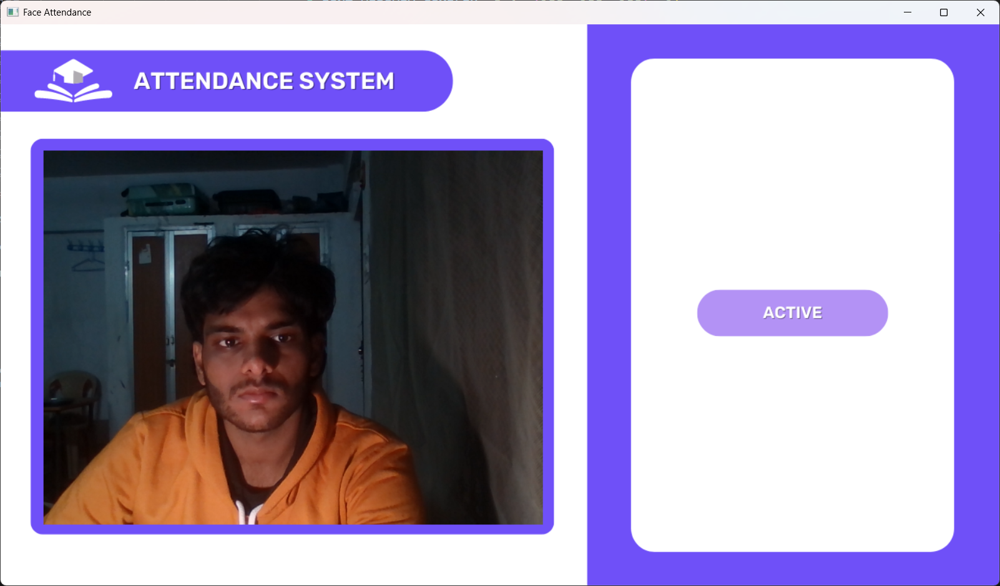
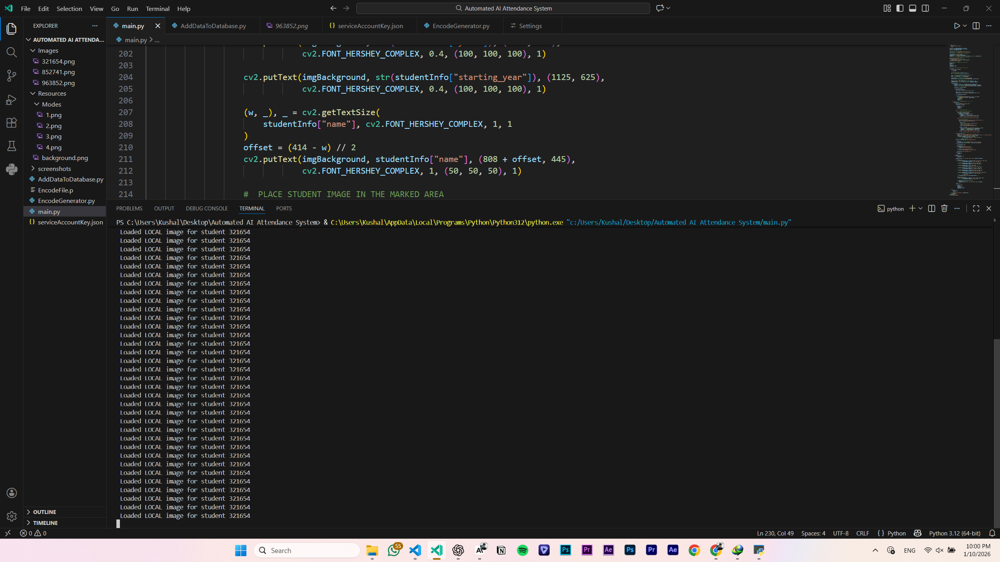

# 🤖 Automated AI Attendance System

<div align="center">


**An intelligent attendance system powered by facial recognition technology**

[Features](#-features) • [Installation](#-installation) • [Usage](#️-usage) • [Documentation](#-how-it-works)

</div>

---

## 📋 Table of Contents

- [Overview](#-overview)
- [Screenshots](#-screenshots)
- [Features](#-features)
- [Technologies Used](#️-technologies-used)
- [Project Structure](#-project-structure)
- [Installation](#-installation)
- [Firebase Setup](#-firebase-setup)
- [Usage](#️-usage)
- [Code Documentation](#-code-documentation)
- [How It Works](#-how-it-works)
- [Troubleshooting](#-troubleshooting)
- [Contributing](#-contributing)
- [License](#-license)

## 📖 Overview

The Automated AI Attendance System is a sophisticated facial recognition application that revolutionizes traditional attendance tracking. Built with Python, OpenCV, and Firebase, it leverages advanced computer vision algorithms to detect, recognize, and record student attendance in real-time with minimal human intervention.

**Key Highlights:**
- ⚡ Real-time face detection and recognition
- 🔄 Automatic attendance marking with duplicate prevention
- ☁️ Cloud-based data storage using Firebase
- 📊 Comprehensive student information display
- 🎨 Professional UI with visual feedback
- 🔒 Secure and reliable attendance tracking

## 📸 Screenshots

<div align="center">

### System Interface - Active State

*Real-time webcam feed showing the attendance system in active mode with corner detection*

### Face Recognition & Student Profile

*Successful face recognition displaying complete student profile with attendance count*

### Duplicate Prevention System

*Smart duplicate prevention showing "Already Marked" status for same-day attendance*

### Development Environment

*Complete project structure and implementation in VS Code IDE*

</div>

## 🚀 Features

### Core Functionality
- **🎯 Real-time Face Detection**: Instant detection using face_recognition library with HOG algorithm
- **🧠 Face Encoding & Recognition**: 128-dimensional face embeddings for accurate identification
- **📸 Multi-Camera Support**: Automatic detection of available cameras (USB/built-in)
- **☁️ Firebase Integration**: Real-time database and cloud storage for data persistence
- **🔄 Auto-Sync**: Automatic synchronization of attendance records
- **⚡ Optimized Performance**: Efficient processing with resized frames and batch operations

### Advanced Features
- **👤 Student Profile Display**: Real-time display of student information (name, ID, major, year, standing)
- **📊 Attendance Analytics**: Tracks total attendance count and last attendance timestamp
- **🚫 Duplicate Prevention**: Prevents multiple check-ins within 30 seconds
- **🎨 Dynamic UI Modes**: 4 different UI states (Active, Loading, Marked, Already Marked)
- **📁 Flexible Image Loading**: Supports both local and Firebase Storage image retrieval
- **🔐 Secure Data Handling**: Firebase Admin SDK for secure database operations
- **🖼️ Image Fallback**: Automatic fallback to .jpg if .png not found
- **📏 Resolution Control**: Configurable camera resolution (640x480 default)

### Technical Features
- **Smart Camera Detection**: Automatically scans for working cameras (index 0-4)
- **Face Distance Calculation**: Uses Euclidean distance for accurate matching
- **Corner Rectangle Overlay**: Visual feedback with corner rectangles on detected faces
- **Timestamp Management**: Tracks attendance with precise datetime stamps
- **Error Handling**: Comprehensive error handling for image loading and database operations
- **Performance Optimization**: 4x scaling for faster face detection processing

## 🛠️ Technologies Used

| Technology | Purpose | Version |
|------------|---------|---------|
| **Python** | Core programming language | 3.8+ |
| **OpenCV (cv2)** | Computer vision and image processing | 4.x |
| **face_recognition** | Facial recognition and encoding | Latest |
| **NumPy** | Numerical computations and array operations | Latest |
| **CVZone** | Computer vision utilities (cornerRect, putTextRect) | Latest |
| **Firebase Admin SDK** | Database and storage integration | Latest |
| **pickle** | Serialization of face encodings | Built-in |
| **datetime** | Timestamp management | Built-in |

### External Dependencies
```
opencv-python>=4.5.0
face-recognition>=1.3.0
numpy>=1.19.0
cvzone>=1.5.0
firebase-admin>=5.0.0
```

## 📁 Project Structure

```
Automated-AI-Attendance-System/
│
├── 📂 Images/                          # Student face images (ID-based naming)
│   ├── 321654.png                      # Kaushal Kumar's image
│   ├── 852741.png                      # Nibedita Misra's image
│   ├── 963852.png                      # Rishabh Raj's image
│   └── ...
│
├── 📂 Resources/                       # UI assets and graphics
│   ├── background.png                  # Main application background (1280x720)
│   └── Modes/                          # UI mode states
│       ├── 1.png                       # Mode 0: Active/Idle state
│       ├── 2.png                       # Mode 1: Loading state
│       ├── 3.png                       # Mode 2: Marked successfully
│       └── 4.png                       # Mode 3: Already marked
│
├── 📂 screenshots/                     # Documentation screenshots
│   ├── active-system.png
│   ├── face-detection.png
│   ├── loading-screen.png
│   └── development-environment.png
│
├── 📄 main.py                          # Main application (259 lines)
├── 📄 AddDataToDatabase.py             # Add student data to Firebase (68 lines)
├── 📄 EncodeGenerator.py               # Generate face encodings (124 lines)
├── 📄 EncodeFile.p                     # Pickled face encodings (binary)
├── 📄 serviceAccountKey.json           # Firebase credentials (⚠️ KEEP SECRET!)
├── 📄 requirements.txt                 # Python dependencies
├── 📄 .gitignore                       # Git ignore rules
└── 📄 README.md                        # This file
```

### File Descriptions

| File | Purpose | Lines of Code |
|------|---------|---------------|
| `main.py` | Main attendance system with camera feed | 259 |
| `AddDataToDatabase.py` | Initialize Firebase with student data | 68 |
| `EncodeGenerator.py` | Generate and save face encodings | 124 |
| `EncodeFile.p` | Serialized face encodings (pickle) | Binary |
| `serviceAccountKey.json` | Firebase authentication credentials | JSON |

## 📦 Installation

### Prerequisites

Before starting, ensure you have:

- ✅ **Python 3.8 or higher** ([Download](https://www.python.org/downloads/))
- ✅ **pip** (comes with Python)
- ✅ **Webcam** (built-in or external USB camera)
- ✅ **Firebase Account** ([Create Free Account](https://console.firebase.google.com/))
- ✅ **Git** (optional, for cloning)

### System-Specific Requirements

#### Windows
```bash
# Install Visual C++ Build Tools
# Download from: https://visualstudio.microsoft.com/visual-cpp-build-tools/

# Install CMake
pip install cmake
```

#### macOS
```bash
# Install Homebrew (if not installed)
/bin/bash -c "$(curl -fsSL https://raw.githubusercontent.com/Homebrew/install/HEAD/install.sh)"

# Install CMake
brew install cmake
```

#### Linux (Ubuntu/Debian)
```bash
sudo apt-get update
sudo apt-get install -y python3-dev python3-pip
sudo apt-get install -y cmake libopenblas-dev liblapack-dev
sudo apt-get install -y libx11-dev libgtk-3-dev
```

### Step-by-Step Installation

#### 1️⃣ Clone or Download the Repository

**Option A: Using Git**
```bash
git clone https://github.com/kaushalkr585-cmd/Automated-AI-Attendance-System.git
cd Automated-AI-Attendance-System
```

**Option B: Download ZIP**
- Download from GitHub
- Extract the ZIP file
- Navigate to the extracted folder

#### 2️⃣ Create Virtual Environment (Recommended)

```bash
# Windows
python -m venv venv
venv\Scripts\activate

# macOS/Linux
python3 -m venv venv
source venv/bin/activate
```

#### 3️⃣ Install Dependencies

**Install all packages:**
```bash
pip install opencv-python
pip install face-recognition
pip install numpy
pip install cvzone
pip install firebase-admin
```

**Or use requirements.txt:**
```bash
pip install -r requirements.txt
```

#### 4️⃣ Install dlib (Critical for face_recognition)

**Windows:**
```bash
pip install cmake
pip install dlib
# If above fails, use pre-compiled wheel:
pip install dlib-binary
```

**macOS:**
```bash
brew install cmake
pip install dlib
```

**Linux:**
```bash
sudo apt-get install cmake libboost-all-dev
pip install dlib
```

#### 5️⃣ Verify Installation

```python
# Create test_install.py
import cv2
import face_recognition
import firebase_admin
print("✅ All packages installed successfully!")
```

```bash
python test_install.py
```

## 🔥 Firebase Setup

### Step 1: Create Firebase Project

1. Go to [Firebase Console](https://console.firebase.google.com/)
2. Click **"Create a project"**
3. Enter project name: `automated-attendance-system`
4. Disable Google Analytics (optional)
5. Click **"Create project"**

### Step 2: Enable Realtime Database

1. In Firebase Console → **Build** → **Realtime Database**
2. Click **"Create Database"**
3. Select location (closest to you)
4. Start in **"Test mode"** for development
5. Click **"Enable"**

**Database URL will be:**
```
https://automated-attendance-sys-7132e-default-rtdb.firebaseio.com/
```

### Step 3: Enable Firebase Storage

1. Navigate to **Build** → **Storage**
2. Click **"Get started"**
3. Start in **"Test mode"**
4. Select same location as database
5. Click **"Done"**

**Storage bucket will be:**
```
automated-attendance-sys-7132e.appspot.com
```

### Step 4: Generate Service Account Key

1. Click **Project Settings** (⚙️ gear icon)
2. Go to **"Service accounts"** tab
3. Click **"Generate new private key"**
4. Click **"Generate key"**
5. Save downloaded JSON file as `serviceAccountKey.json`
6. **Move file to project root directory**

⚠️ **CRITICAL**: Never commit this file to GitHub!

### Step 5: Update .gitignore

```gitignore
# Firebase credentials
serviceAccountKey.json
*.json

# Face encodings
EncodeFile.p
*.p

# Python cache
__pycache__/
*.pyc
*.pyo

# Virtual environment
venv/
env/

# IDE
.vscode/
.idea/
```

### Step 6: Configure Database Structure

Your Firebase Realtime Database will have this structure:

```json
{
  "Students": {
    "321654": {
      "name": "Kaushal Kumar",
      "major": "Computer Science",
      "starting_year": 2022,
      "total_attendance": 0,
      "standing": "Excellent",
      "year": 4,
      "branch": "CSE",
      "last_attendance_time": "2025-01-10 14:30:00"
    },
    "852741": {
      "name": "Nibedita Misra",
      "major": "Psychology",
      "starting_year": 2021,
      "total_attendance": 0,
      "standing": "Good",
      "year": 4,
      "branch": "Humanities",
      "last_attendance_time": "2025-01-10 14:30:00"
    }
  }
}
```

## ▶️ Usage

### Complete Workflow

```
1. Add Student Data → 2. Add Images → 3. Generate Encodings → 4. Run System
```

### Step 1: Add Student Data to Firebase

Edit `AddDataToDatabase.py` to add your students:

```python
data = {
    "321654": {
        "name": "Kaushal Kumar",
        "major": "Computer Science",
        "starting_year": 2022,
        "total_attendance": 0,
        "standing": "Excellent",
        "year": 4,
        "branch": "CSE",
        "last_attendance_time": current_time
    }
}
```

**Run the script:**
```bash
python AddDataToDatabase.py
```

**Expected Output:**
```
Firebase initialized successfully
Adding student data to database...
Added student: Kaushal Kumar (ID: 321654)
Added student: Nibedita Misra (ID: 852741)
Added student: Rishabh Raj (ID: 963852)

All student data added successfully!
```

### Step 2: Add Student Images

1. **Take clear photos** of students (front-facing)
2. **Name files** with student ID: `321654.png`, `852741.png`, etc.
3. **Place in `Images/` folder**

**Image Guidelines:**
- ✅ Format: PNG or JPG
- ✅ Resolution: 500x500px minimum
- ✅ Face clearly visible
- ✅ Good lighting
- ✅ Neutral background
- ❌ No glasses/hats (if possible)
- ❌ No multiple faces in image

**Example:**
```
Images/
├── 321654.png  # Kaushal Kumar
├── 852741.png  # Nibedita Misra
└── 963852.png  # Rishabh Raj
```

### Step 3: Generate Face Encodings

This creates the `EncodeFile.p` file with face embeddings:

```bash
python EncodeGenerator.py
```

**Expected Output:**
```
==================================================
Face Encoding Generator
==================================================

Found 3 images: ['321654.png', '852741.png', '963852.png']
Loaded: 321654.png -> ID: 321654
Loaded: 852741.png -> ID: 852741
Loaded: 963852.png -> ID: 963852

Successfully loaded 3 images
Student IDs: ['321654', '852741', '963852']

==================================================
Encoding Started...
==================================================

==================================================
✓ Encoding Complete
  Successfully encoded: 3 faces
==================================================

✓ Encoding file saved successfully as 'EncodeFile.p'
  Total students encoded: 3
  Student IDs: ['321654', '852741', '963852']

==================================================
✓ ENCODING GENERATION COMPLETED SUCCESSFULLY!
  You can now run main.py to start attendance system
==================================================
```

### Step 4: Run Attendance System

Start the main application:

```bash
python main.py
```

**Expected Console Output:**
```
✓ Using camera index 0
Loading Encode File ...
Encode File Loaded
```

**System will display:**
- Live webcam feed (640x480)
- Face detection with corner rectangles
- Student information panel (right side)
- UI mode indicators

**Keyboard Controls:**
- Press `ESC` to quit
- Press `Q` to quit
- System runs continuously

### Step 5: Using the System

1. **Position yourself** in front of the camera
2. **Wait for detection** (green corner rectangles appear)
3. **System processes** and shows "Loading" message
4. **Student info displays** on the right panel:
   - Profile picture
   - Name
   - Student ID
   - Major/Branch
   - Total attendance count
   - Year and standing
   - Starting year
5. **Attendance is marked** automatically
6. **Cannot re-mark** for 30 seconds (duplicate prevention)

## 📚 Code Documentation

### main.py - Core Application

#### Key Components

**1. Firebase Initialization (Lines 9-20)**
```python
cred = credentials.Certificate("serviceAccountKey.json")
firebase_admin.initialize_app(cred, {
    "databaseURL": "https://automated-attendance-sys-7132e-default-rtdb.firebaseio.com/",
    "storageBucket": "automated-attendance-sys-7132e.appspot.com"
})
```

**2. Smart Camera Detection (Lines 23-32)**
```python
def get_working_camera(max_index=5):
    for i in range(max_index):
        cap = cv2.VideoCapture(i)
        if cap.isOpened():
            ret, _ = cap.read()
            if ret:
                return cap
    return None
```
*Automatically detects available cameras from index 0 to 4*

**3. Face Detection & Recognition (Lines 85-97)**
```python
imgS = cv2.resize(img, (0, 0), None, 0.25, 0.25)  # Resize to 25% for speed
facesCurFrame = face_recognition.face_locations(imgS)
encodesCurFrame = face_recognition.face_encodings(imgS, facesCurFrame)

matches = face_recognition.compare_faces(encodeListKnown, encodeFace)
faceDis = face_recognition.face_distance(encodeListKnown, encodeFace)
matchIndex = np.argmin(faceDis)  # Find best match
```

**4. Duplicate Prevention (Lines 166-177)**
```python
last_time = studentInfo.get("last_attendance_time")
if last_time:
    last_time = datetime.strptime(last_time, "%Y-%m-%d %H:%M:%S")
    secondsElapsed = (datetime.now() - last_time).total_seconds()
else:
    secondsElapsed = 999

if secondsElapsed > 30:  # 30 seconds cooldown
    # Mark attendance
    ref.child("total_attendance").set(studentInfo["total_attendance"] + 1)
    ref.child("last_attendance_time").set(datetime.now().strftime("%Y-%m-%d %H:%M:%S"))
```

**5. Image Loading with Fallback (Lines 128-158)**
```python
# Try local first
local_path = f"Images/{id}.png"
if os.path.exists(local_path):
    imgStudent = cv2.imread(local_path)
else:
    # Try Firebase Storage
    blob = bucket.get_blob(f"Images/{id}.png")
    if blob is None:
        blob = bucket.get_blob(f"Images/{id}.jpg")  # Fallback to .jpg
    if blob is not None:
        array = np.frombuffer(blob.download_as_string(), np.uint8)
        imgStudent = cv2.imdecode(array, cv2.IMREAD_COLOR)
```

### AddDataToDatabase.py - Student Data Management

**Initialize Firebase (Lines 6-17)**
```python
def initialize_firebase():
    try:
        firebase_admin.get_app()
        print("Firebase already initialized")
    except ValueError:
        cred = credentials.Certificate("serviceAccountKey.json")
        firebase_admin.initialize_app(cred, {
            'databaseURL': 'https://automated-attendance-sys-7132e-default-rtdb.firebaseio.com/'
        })
```

**Add Student Data (Lines 19-68)**
```python
ref = db.reference('Students')
data = {
    "321654": {
        "name": "Kaushal Kumar",
        "major": "Computer Science",
        # ... more fields
    }
}
for key, value in data.items():
    ref.child(key).set(value)
```

### EncodeGenerator.py - Face Encoding Generation

**Generate Encodings (Lines 5-20)**
```python
def find_encodings(images_list):
    encode_list = []
    for img in images_list:
        img = cv2.cvtColor(img, cv2.COLOR_BGR2RGB)
        encodings = face_recognition.face_encodings(img)
        if len(encodings) > 0:
            encode_list.append(encodings[0])
    return encode_list
```

**Save Encodings (Lines 90-96)**
```python
with open("EncodeFile.p", 'wb') as file:
    pickle.dump([valid_encodings, valid_ids], file)
```

## 🔄 How It Works

### System Architecture

```
┌──────────────────────────────────────────────────────────────────┐
│                    SYSTEM ARCHITECTURE                            │
├──────────────────────────────────────────────────────────────────┤
│                                                                    │
│  ┌─────────────┐         ┌──────────────┐        ┌────────────┐ │
│  │   Webcam    │────────▶│  main.py     │───────▶│  Firebase  │ │
│  │  (Camera)   │         │ (Processing) │        │ (Database) │ │
│  └─────────────┘         └──────────────┘        └────────────┘ │
│        │                        │                        │        │
│        │ Video Stream           │ Face Encodings        │ Data   │
│        ▼                        ▼                        ▼        │
│  ┌─────────────┐         ┌──────────────┐        ┌────────────┐ │
│  │ Face Detect │         │ EncodeFile.p │        │  Storage   │ │
│  │   OpenCV    │         │  (Pickle)    │        │  (Images)  │ │
│  └─────────────┘         └──────────────┘        └────────────┘ │
│                                                                    │
└──────────────────────────────────────────────────────────────────┘
```

### Detailed Workflow

#### 1. Initialization Phase
```
a) Load serviceAccountKey.json
b) Connect to Firebase (Database + Storage)
c) Initialize camera (auto-detect working camera)
d) Set camera properties (640x480, 30 FPS)
e) Load UI resources (background.png, Modes/*.png)
f) Load face encodings from EncodeFile.p
```

#### 2. Main Loop (Continuous)
```
┌─────────────────────────────────────────────────────────┐
│  START LOOP                                              │
│    │                                                      │
│    ├─→ Capture Frame (640x480)                          │
│    │                                                      │
│    ├─→ Resize Frame (25% for speed optimization)        │
│    │                                                      │
│    ├─→ Detect Faces (face_recognition.face_locations)   │
│    │                                                      │
│    ├─→ IF Face Detected:                                │
│    │   ├─→ Generate Encoding (128-dim vector)           │
│    │   ├─→ Compare with Known Encodings                 │
│    │   ├─→ Calculate Face Distance (Euclidean)          │
│    │   ├─→ Find Best Match (argmin)                     │
│    │   ├─→ IF Match Found:                              │
│    │   │   ├─→ Draw Corner Rectangle                    │
│    │   │   ├─→ Show "Loading" (Mode 1)                  │
│    │   │   ├─→ Fetch Student Data from Firebase        │
│    │   │   ├─→ Load Student Image (local/Firebase)      │
│    │   │   ├─→ Check Last Attendance Time               │
│    │   │   ├─→ IF > 30 seconds:                         │
│    │   │   │   ├─→ Increment total_attendance           │
│    │   │   │   ├─→ Update last_attendance_time          │
│    │   │   │   └─→ Show Success (Mode 2)                │
│    │   │   └─→ ELSE:                                    │
│    │   │       └─→ Show "Already Marked" (Mode 3)       │
│    │   │                                                 │
│    │   └─→ Display Student Info for 10 frames           │
│    │                                                      │
│    ├─→ Overlay UI Elements                              │
│    ├─→ Show Frame                                        │
│    └─→ Check for ESC key                                │
│                                                          │
│  END LOOP (or ESC pressed)                               │
└─────────────────────────────────────────────────────────┘
```

#### 3. Face Recognition Algorithm

**Step-by-Step Process:**

1. **Capture & Preprocess**
   ```python
   img = cap.read()  # 640x480
   imgS = cv2.resize(img, (0,0), None, 0.25, 0.25)  # 160x120 (4x faster)
   imgS = cv2.cvtColor(imgS, cv2.COLOR_BGR2RGB)
   ```

2. **Face Detection**
   ```python
   facesCurFrame = face_recognition.face_locations(imgS)
   # Returns: [(top, right, bottom, left), ...]
   ```

3. **Face Encoding**
   ```python
   encodesCurFrame = face_recognition.face_encodings(imgS, facesCurFrame)
   # Returns: [128-dim numpy array, ...]
   ```

4. **Comparison**
   ```python
   matches = face_recognition.compare_faces(encodeListKnown, encodeFace)
   # Returns: [True, False, False, ...]
   
   faceDis = face_recognition.face_distance(encodeListKnown, encodeFace)
   # Returns: [0.42, 0.68, 0.55, ...]  (lower = better match)
   ```

5. **Best Match Selection**
   ```python
   matchIndex = np.argmin(faceDis)  # Index of lowest distance
   if matches[matchIndex]:  # If below threshold (0.6)
       student_id = studentIds[matchIndex]
   ```

6. **Attendance Update**
   ```python
   ref = db.reference(f"Students/{id}")
   ref.child("total_attendance").set(count + 1)
   ref.child("last_attendance_time").set(datetime.now())
   ```

### UI Mode States

| Mode | Value | Description | Display |
|------|-------|-------------|---------|
| **Active** | 0 | Idle, waiting for face | `Modes/1.png` |
| **Loading** | 1 | Face detected, processing | `Modes/2.png` + "Loading" text |
| **Marked** | 2 | Attendance marked successfully | `Modes/3.png` + Student info |
| **Already Marked** | 3 | Already attended today | `Modes/4.png` + "Already Marked" |

### Camera Configuration

```python
CAM_WIDTH = 640
CAM_HEIGHT = 480
cap.set(cv2.CAP_PROP_FRAME_WIDTH, CAM_WIDTH)
cap.set(cv2.CAP_PROP_FRAME_HEIGHT, CAM_HEIGHT)
cap.set(cv2.CAP_PROP_FPS, 30)
```

**Layout:**
- Camera feed: `imgBackground[162:642, 55:695]` (640x480)
- UI panel: `imgBackground[44:677, 808:1222]` (414x633)
- Student image: `imgBackground[175:391, 909:1125]` (216x216)

## 🔧 Troubleshooting

### Common Issues & Solutions

#### Issue 1: Camera Not Detected
```
Error: No camera found
```

**Solutions:**
1. Check camera permissions in system settings
2. Verify camera is not used by another application
3. Try different camera index:
   ```python
   cap = cv2.VideoCapture(1)  # or 2, 3, etc.
   ```
4. Test camera with:
   ```python
   import cv2
   cap = cv2.VideoCapture(0)
   ret, frame = cap.read()
   print("Camera working" if ret else "Camera failed")
   ```

#### Issue 2: Face Not Recognized
```
Warning: No face detected
```

**Solutions:**
1. **Improve lighting** - Use bright, even lighting
2. **Face camera directly** - Look straight at the camera
3. **Remove obstructions** - Take off glasses/hats
4. **Check image quality**:
   ```python
   img = cv2.imread("Images/321654.png")
   print(img.shape)  # Should be (height, width, 3)
   ```
5. **Re-generate encodings**:
   ```bash
   python EncodeGenerator.py
   ```

#### Issue 3: Firebase Connection Error
```
Error: Could not connect to Firebase
```

**Solutions:**
1. Verify `serviceAccountKey.json` exists
2. Check Firebase URLs match:
   ```python
   "databaseURL": "https://automated-attendance-sys-7132e-default-rtdb.firebaseio.com/"
   "storageBucket": "automated-attendance-sys-7132e.appspot.com"
   ```
3. Ensure internet connection
4. Check Firebase console for project status
5. Verify database rules allow access

#### Issue 4: Import Errors
```
ModuleNotFoundError: No module named 'face_recognition'
```

**Solutions:**
```bash
# Windows - Install Visual C++ Build Tools first
pip install cmake
pip install dlib
pip install face-recognition

# If dlib fails on Windows:
pip install dlib-binary

# macOS
brew install cmake
pip install face-recognition

# Linux
sudo apt-get install cmake libboost-all-dev
pip install face-recognition
```

#### Issue 5: Encoding File Not Found
```
FileNotFoundError: [Errno 2] No such file or directory: 'EncodeFile.p'
```

**Solution:**
```bash
python EncodeGenerator.py
```

#### Issue 6: Slow Performance
```
System is laggy
```

**Solutions:**
1. Reduce detection frequency:
   ```python
   if counter % 30 == 0:  # Process every 30 frames
       # Face detection code
   ```
2. Lower resolution:
   ```python
   CAM_WIDTH = 480
   CAM_HEIGHT = 360
   ```
3. Increase resize scale:
   ```python
   imgS = cv2.resize(img, (0, 0), None, 0.2, 0.2)  # 20% instead of 25%
   ```
4. Close unnecessary applications

#### Issue 7: Image Loading Fails
```
Error: Could not read image
```

**Solutions:**
1. Check file naming: `321654.png` (ID matches database